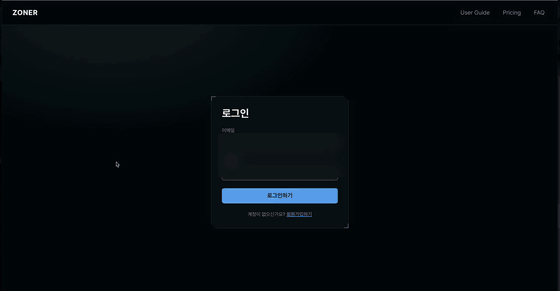
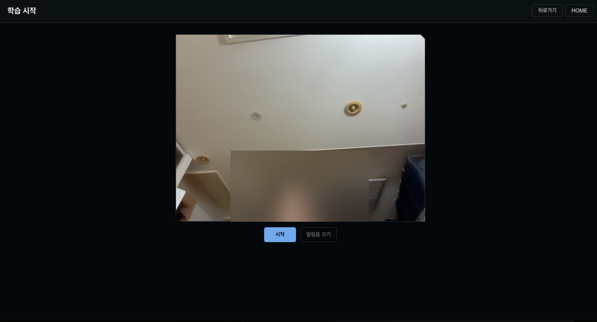
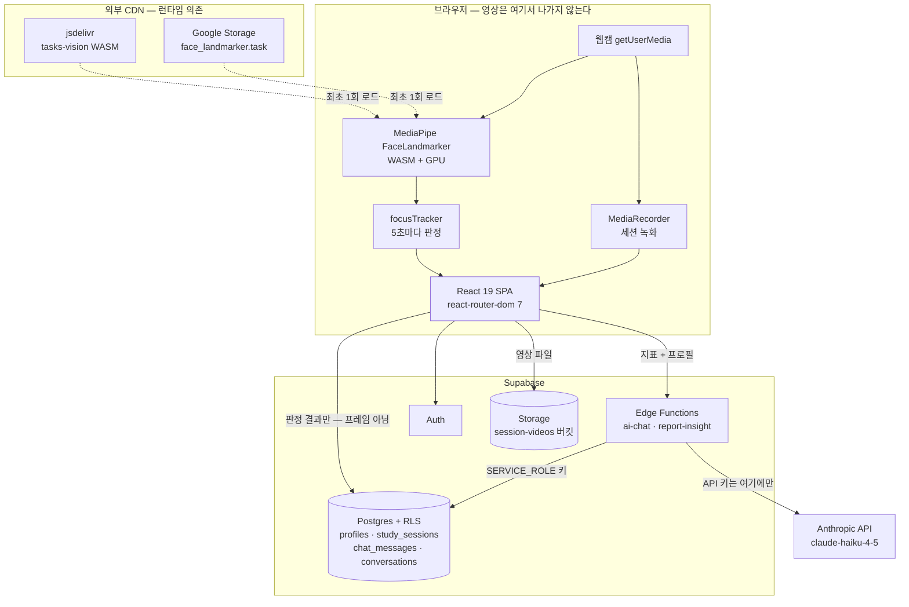

# Zoner

**웹캠으로 학습 집중도를 실시간으로 재고, 세션이 끝나면 근거가 붙은 리포트를 만들어 주는 웹 앱.**

공부한 시간은 어디서나 기록되지만 "그 시간에 실제로 집중했는지"는 아무도 알려주지 않는다.
Zoner는 학습 중 웹캠 영상을 **브라우저 안에서만** 분석해 5초마다 집중 여부를 판정하고,
끝나면 언제 무너졌는지·무엇이 방해했는지를 수치로 돌려준다.



> **배포 링크 없음.** 현재는 로컬 실행 전용이다. 웹캠 권한이 필요해 `https` 또는
> `localhost`에서만 동작하며, 아래 [로컬 실행](#로컬-실행)으로 3분 안에 띄울 수 있다.

---

## 핵심 기능

### 1. 실시간 집중도 측정



웹캠 프레임에서 얼굴 랜드마크를 뽑아 **5초마다** 한 번씩 판정한다. 결과는 6개 상태 중 하나다.

| 상태 | 판정 기준 | 집중으로 집계 |
|---|---|---|
| `focused` | 정면 응시 | ✅ |
| `looking_down` | 고개 숙임(pitch < −20°) 또는 시선 하향 | ✅ |
| `head_turned` | 고개 좌우 회전(yaw 절댓값 > 30°) | ❌ |
| `looking_up` | 고개 들림(pitch > 20°) | ❌ |
| `eyes_closed` | 양눈 감김이 **연속 2회** | ❌ |
| `absent` | 얼굴 미검출 | ❌ |

화면에는 누적 평균이 아니라 **최근 2분 이동 창**의 집중률을 띄운다.
누적 평균은 세션이 길어질수록 둔해져서, 30분쯤 지나면 고개를 들어도 숫자가 거의 안 움직인다.

### 2. 비집중 알림

집중이 무너지면 화면 배너와 소리로 알린다. 알림 발생 시각은 세션에 함께 저장돼 리포트의 `시간당 알림 횟수`가 된다.

### 3. 세션 리포트


저장된 세션 하나만 보고 파생 지표 9종을 계산한다 — 순 집중 시간, 최장 집중 지속, 첫 이탈 시점,
전·후반 격차, 변동성(모표준편차), 최고/최저 구간, 시간당 알림, 최대 방해 원인.

여기에 **AI 조언 문단**이 붙는다. 단, 수치는 전부 앱이 계산해 넘기고 모델은 읽기만 한다.
모델에게 통계를 시키면 숫자가 틀린다.

### 4. PDF 저장


리포트를 인쇄용 문서 레이아웃으로 재구성해 저장한다. 화면용 계측 장식(격자·노치·브래킷·글로우)은
인쇄 시 일괄 해제된다.

### 5. AI 튜터 채팅 · 6. 휴지통 복구


대화별로 이력이 남는 학습 보조 채팅(1일 30메시지 제한). 삭제한 세션은 휴지통을 거쳐 복구할 수 있다.

---

## 설계에서 신경 쓴 것

자랑을 늘어놓기보다, 판단이 갈렸던 지점만 적는다.

**얼굴 추론을 서버가 아니라 브라우저에서 돌린다.**
학습 영상은 민감한 데이터다. 프레임을 서버로 보내면 전송·보관 양쪽에서 책임이 생기고 지연도 붙는다.
MediaPipe FaceLandmarker를 WASM+GPU로 브라우저에서 실행해 **영상 프레임이 기기 밖으로 나가지 않게** 했다.
서버에 올라가는 건 5초마다 한 번씩 나오는 판정 결과(집중 여부와 사유)뿐이다.

**`looking_down`을 집중으로 집계한다.**
얼굴만 보는 모델로는 교재를 보는 것과 휴대폰을 보는 것을 구분할 수 없다.
둘 중 하나로 정해야 한다면, **공부 중인 사용자를 딴짓으로 오판하는 쪽이 반대 방향 오차보다 비용이 크다**고 봤다.
잘못 칭찬하면 넘어가지만, 잘못 혼내면 앱을 끈다.

**눈 감김은 연속 2회일 때만 졸음으로 본다.**
깜빡임은 0.1~0.4초다. 5초 샘플링으로는 깜빡임과 졸음을 한 번에 구분할 수 없다.
샘플링 주기를 줄이는 대신 연속성 조건을 붙였다 — 배터리와 발열을 덜 쓰는 쪽을 골랐다.

**리포트의 "무너짐" 판정에서 앞 2분을 뺀다.**
카메라가 얼굴을 잡고 자세를 잡는 동안이라 거의 모든 세션이 0분 구간에서 낮게 찍힌다.
그대로 세면 "집중 지속 한계 약 0분" 같은 뜻 없는 값이 나온다. 워밍업은 이탈이 아니다.

**권한을 앱 코드가 아니라 DB에서 막는다.**
모든 테이블과 스토리지 버킷에 RLS를 켜고 정책 18개를 `auth.uid() = user_id`로 걸었다.
앱 코드에서 소유자 조건을 빠뜨려도 남의 데이터가 새지 않는다.

**Anthropic API 키는 클라이언트에 없다.**
AI 기능은 전부 Supabase Edge Function을 거친다. 브라우저가 아는 건 Supabase anon 키뿐이고,
그건 RLS로 보호된다. Edge Function은 클라이언트가 보낸 본문을 신뢰하지 않는다 —
숫자는 `Number`로 강제 변환하고 라벨은 허용 목록으로만 받는다. 프롬프트 인젝션 방지다.

**다크 단일 테마로 고정했다.**
라이트 테마를 추가하면 전 화면 대비비를 다시 검증해야 한다.
두 테마를 어설프게 지원하느니 한쪽을 제대로 하는 편이 낫다고 판단했다.

---

## 기술 스택

무엇을 썼는지보다 왜 골랐는지가 중요하다.

| 기술 | 왜 |
|---|---|
| **React 19** | 화면 상태가 많고(측정 중·일시정지·경고·저장) 컴포넌트 재사용이 필요했다 |
| **Create React App** | 이미 CRA로 시작한 프로젝트다. Vite 이전은 기능 완성보다 우선순위가 낮다고 보고 미뤘다 — 대신 [알려진 한계](#알려진-한계)에 적어 둔다 |
| **MediaPipe Tasks Vision** | 브라우저에서 WASM+GPU로 도는 얼굴 랜드마크 모델. 자체 학습 없이 랜드마크·블렌드셰이프·머리 회전 행렬을 한 번에 준다 |
| **Supabase** | Auth·Postgres·Storage·Edge Functions를 한 곳에서 받는다. 개인 프로젝트에서 인증 서버를 직접 만들 이유가 없었다. RLS가 결정적이었다 |
| **Edge Functions (Deno)** | API 키를 서버 쪽에 두기 위한 최소 백엔드. 별도 서버를 띄우지 않아도 된다 |
| **Claude Haiku 4.5** | 조언 문단 생성·채팅 응답용. 응답 속도와 비용이 중요했고, 수치 계산은 어차피 앱이 하므로 상위 모델이 필요 없었다 |
| **Jest + Testing Library** | CRA 번들 그대로. 순수 로직(`src/lib/`) 위주로 덮었다 |

---

## 아키텍처



읽는 순서에서 중요한 두 가지다.

- **웹캠 프레임은 브라우저 경계를 넘지 않는다.** Supabase로 가는 건 판정 결과와, 사용자가 켰을 때의 녹화 파일이다.
- **MediaPipe의 WASM 런타임과 모델 가중치는 외부 CDN에서 받는다.** 오프라인에서는 측정이 시작되지 않는다.
  개인 프로젝트라 CDN을 그대로 썼지만, 실서비스라면 자가 호스팅 대상이다.

---

## 로컬 실행

```bash
git clone https://github.com/jjssspark/Zoner.git
cd Zoner
npm install

cp .env.example .env
# .env에 Supabase 프로젝트의 URL과 anon 키를 채운다
#   REACT_APP_SUPABASE_URL=https://<project-ref>.supabase.co
#   REACT_APP_SUPABASE_ANON_KEY=<anon key>

npm start        # http://localhost:3000
```

DB 스키마가 필요하면 `supabase/migrations/`의 SQL 11개를 파일명 순서대로 실행한다.
AI 기능(`/ai-chat`, 리포트 조언)까지 쓰려면 Edge Function 2개를 배포하고 `ANTHROPIC_API_KEY`를 설정해야 한다.

```bash
supabase functions deploy ai-chat
supabase functions deploy report-insight
supabase secrets set ANTHROPIC_API_KEY=<key>
```

**웹캠 권한이 필요하다.** 브라우저 정책상 `localhost` 또는 `https`에서만 카메라가 열린다.

### 기타 명령

```bash
CI=true npx react-scripts test --watchAll=false   # 테스트 전체
npx react-scripts build                           # 프로덕션 빌드
```

---

## 데이터 모델

| 테이블 | 용도 | RLS |
|---|---|---|
| `profiles` | 사용자 프로필 | select / insert / update — 본인만 |
| `study_sessions` | 세션 결과. 집중 점수, 분 단위 타임라인, 원인별 비율, 알림 기록, 영상 경로, 휴지통 플래그 | select / insert / update / delete — 본인만 |
| `conversations` | AI 채팅 대화방 | select / insert / update / delete — 본인만 |
| `chat_messages` | 대화 메시지 | select / insert — 본인만 |
| `session-videos` (Storage) | 세션 녹화 파일. 경로 첫 폴더가 `auth.uid()` | select / insert / update / delete — 본인만 |

정책 18개가 전부 `auth.uid() = user_id` 기준이다. 원문은 `supabase/migrations/`에 있다.

---

## 테스트

```
Test Suites: 22 passed, 22 total
Tests:       276 passed, 276 total
```

화면 컴포넌트가 아니라 **판단이 들어간 순수 로직**을 덮었다 — 집중 판정 임계값 경계,
세션 집계, 파생 지표, 알림 규칙, 학습 성향 분류, 휴지통 상태 전이, 녹화 상태 전이,
그리고 CSS 토큰 참조 정합성.

`react-router-dom`을 import 하는 파일에는 테스트를 쓰지 않는다.
CRA 번들 Jest 리졸버가 v7 exports 맵을 해석하지 못한다 (`docs/TROUBLESHOOTING.md` TS-003).
그래서 순수 함수는 `src/lib/`에, 라우터에 의존하지 않는 프레젠테이션 컴포넌트는 `src/components/ui/`에 둔다.

### 번들 크기 (gzip)

| | 크기 |
|---|---|
| JS (main) | 150.78 kB |
| CSS | 11.8 kB |

---

## 프로젝트 구조

```
src/
├── features/          기능 단위. 이 안에서 자급자족한다
│   ├── marketing/     Home · FAQ · Pricing · UserGuide
│   ├── auth/          Login · SignUp
│   ├── learning/      StartLearning (측정 화면)
│   ├── records/       Save · Read(리포트) · Trash · Trashread
│   ├── profile/       Mypage
│   └── chat/          AiChat
├── components/
│   ├── layout/        NavBar
│   └── ui/            ScoreRing · Sparkline · Skeleton · ReasonBadge · ConfirmDialog
├── lib/               순수 로직 + 단위 테스트
└── styles/tokens.css  디자인 토큰
```

의존은 **안쪽으로만** 흐른다: `features/` → `components/` → `lib/`.
`features/A`는 `features/B`를 직접 import 하지 않는다. 공유가 필요하면 위로 올린다.

---

## 트러블슈팅

붙잡았던 문제 19건을 증상·재현 조건·**실패한 시도**·근본 원인·검증까지 기록해 뒀다.

→ [`docs/TROUBLESHOOTING.md`](docs/TROUBLESHOOTING.md)

몇 가지만 꼽자면:

- **TS-003** — CRA 번들 Jest 리졸버가 `react-router-dom` v7의 exports 맵을 못 읽어, 테스트 전략 자체를 바꾼 건
- **TS-018** — 리포트 인쇄에서 배경이 안 나오던 문제. 검증 하니스가 이 사각지대를 못 잡고 있었다
- **TS-019** — 인쇄용 토큰 오버라이드가 CSS 소스 순서에 밀려 무력화된 건

설계 문서(`docs/superpowers/specs/`)와 구현 계획(`docs/superpowers/plans/`)도 함께 남아 있다.

---

## 알려진 한계

아는 것과 모르는 것을 구분하는 게 더 중요하다.

- **미배포.** 로컬 실행 전용이다.
- **얼굴만 본다.** 교재를 보는지 휴대폰을 보는지 구분하지 못한다. 그래서 `looking_down`을 집중으로 집계하는 쪽을 택했다.
- **1인 기준.** `numFaces: 1`이라 여러 명이 잡히는 환경은 고려하지 않았다.
- **외부 CDN 의존.** MediaPipe WASM·모델을 런타임에 받아 오므로 오프라인에서는 측정이 시작되지 않는다.
- **CRA를 유지 중.** `react-scripts` 5.0.1은 유지보수가 멈춘 상태다. 이전 비용을 알면서 남겨 둔 부채다.
- **테스트가 로직에 치우쳐 있다.** 화면 단위 E2E가 없다. 위 리졸버 제약이 이유이지만, Playwright로 우회할 수 있는 문제이기도 하다.

---

## 라이선스

[MIT](LICENSE)
