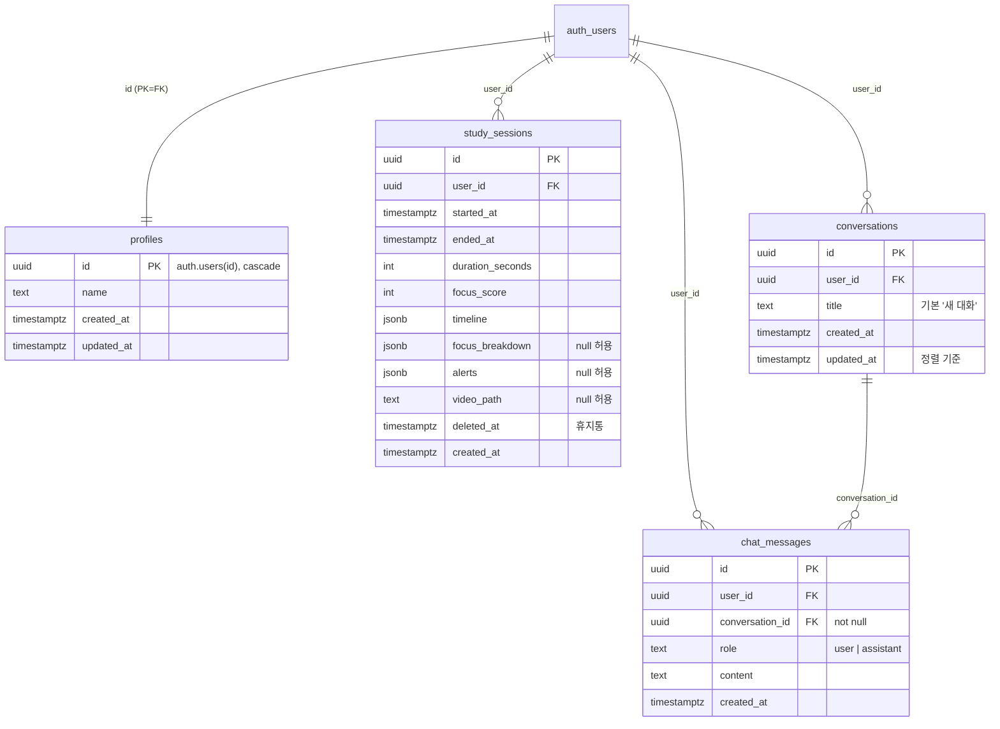

# 데이터 모델

Supabase(Postgres) 스키마와 권한 정책. 원문은 `supabase/migrations/`에 있고,
이 문서는 그 11개 파일이 최종적으로 만드는 상태를 정리한 것이다.

- 테이블 4개, 뷰 1개, Storage 버킷 1개
- RLS 정책 **17개** — 전부 `auth.uid()` 기준 소유자 확인
- 마이그레이션 11개. **파일명 순서대로** 적용해야 한다 (뒤에서 설명하는 순서 의존이 있다)

---

## 전체 구조



Storage 버킷 `session-videos`는 위 다이어그램에 없다. Postgres 관계가 아니라
`storage.objects`에 얹힌 경로 규칙(`{user_id}/{session_id}.webm`)으로 소유자를 판별한다.

---

## profiles

`auth.users`를 그대로 확장한다. 별도 id를 만들지 않고 **PK가 곧 FK**다.

```sql
create table profiles (
  id uuid primary key references auth.users(id) on delete cascade,
  name text not null,
  created_at timestamptz not null default now(),
  updated_at timestamptz not null default now()
);

alter table profiles enable row level security;

create policy "profiles_select_own" on profiles for select using (auth.uid() = id);
create policy "profiles_update_own" on profiles for update using (auth.uid() = id);
create policy "profiles_insert_own" on profiles for insert with check (auth.uid() = id);
```

| 항목 | 값 |
|---|---|
| 정책 | select / update / insert (3개) |
| delete 정책 | **없다.** 계정 삭제는 `auth.users` 삭제로 cascade 된다 |

---

## study_sessions

세션 한 건의 결과 전체. 이 앱에서 가장 많이 바뀐 테이블이고, 컬럼 4개가 나중에 붙었다.

```sql
create table study_sessions (
  id uuid primary key default gen_random_uuid(),
  user_id uuid not null references auth.users(id) on delete cascade,
  started_at timestamptz not null,
  ended_at timestamptz not null,
  duration_seconds int not null,
  focus_score int not null,
  timeline jsonb not null,
  created_at timestamptz not null default now()
);

-- 이후 마이그레이션에서 추가된 컬럼
alter table study_sessions add column deleted_at timestamptz null;       -- 20260805100000
alter table study_sessions add column focus_breakdown jsonb;             -- 20260805150000
alter table study_sessions add column alerts jsonb;                      -- 20260806140000
alter table study_sessions add column video_path text null;              -- 20260806150000

create index idx_study_sessions_user_deleted_at on study_sessions (user_id, deleted_at);
```

### JSONB 컬럼의 내용

앱이 쓰고 앱이 읽는다. DB는 형태를 강제하지 않으므로 **여기가 사실상의 스키마 정의**다.

| 컬럼 | 만드는 곳 | 비고 |
|---|---|---|
| `timeline` | `src/lib/focusTracker.js` | 1분 버킷의 집중도 배열. 리포트 그래프의 x축 |
| `focus_breakdown` | 〃 | 6개 판정 사유별 비율. `Read.js`의 원인별 표시에 쓰인다 |
| `alerts` | `src/lib/alertEngine.js` | 비집중 알림 구간 목록. `시간당 알림 횟수`의 원천 |

세 컬럼 모두 나중에 붙었고, `focus_breakdown`·`alerts`·`video_path`는 **null을 허용한다.**
그 전에 저장된 세션은 값이 없고, 리포트는 null이면 해당 섹션을 렌더하지 않으므로 깨지지 않는다.

`duration_seconds`는 **타이머 틱 수가 아니라 벽시계 누적**이다. 그렇게 하지 않으면
백그라운드 탭에서 학습 시간이 과소 기록된다 (TROUBLESHOOTING.md TS-005).

`timeline`의 버킷 인덱스는 아직 `started_at` 기준 벽시계 분이라, 1분 이상 일시정지하면
저장 시간과 그래프 x축의 기준이 어긋난다. 알고 남겨 둔 부채다.

### 휴지통

물리 삭제를 하지 않는다. `deleted_at`이 `null`이면 활성, 값이 있으면 휴지통이다.
복구는 `deleted_at`을 `null`로 되돌리는 것이고, 인덱스 `(user_id, deleted_at)`이 두 목록 조회를 모두 받는다.

### RLS

```sql
create policy "study_sessions_select_own" on study_sessions for select using (auth.uid() = user_id);
create policy "study_sessions_insert_own" on study_sessions for insert with check (auth.uid() = user_id);
create policy "study_sessions_update_own" on study_sessions for update
  using (auth.uid() = user_id) with check (auth.uid() = user_id);
create policy "study_sessions_delete_own" on study_sessions for delete using (auth.uid() = user_id);
```

`update` 정책에 `using`과 `with check`를 **둘 다** 건다. `using`만 걸면 자기 행을 읽어서
`user_id`를 남의 것으로 바꿔 쓰는 것을 막지 못한다.

---

## active_study_sessions (뷰)

휴지통에 있지 않은 세션만 보여주는 뷰. **화면은 테이블이 아니라 이 뷰에서 읽는다.**

```sql
create or replace view active_study_sessions with (security_invoker = true) as
select
  id, user_id, started_at, ended_at, duration_seconds, focus_score, timeline,
  created_at, deleted_at, focus_breakdown, alerts, video_path
from study_sessions
where deleted_at is null;
```

두 가지가 중요하다.

**`security_invoker = true`가 있어야 RLS가 그대로 적용된다.** 이 플래그가 있으면 뷰가
호출한 사용자의 권한으로 평가돼 아래 `study_sessions`의 정책이 그대로 걸린다.

**컬럼을 고정 나열한다. 그래서 컬럼을 추가할 때마다 뷰를 함께 갱신해야 한다.**
`focus_breakdown`을 테이블에만 추가하고 뷰를 안 고쳐서, 저장은 되는데 화면에서는
읽을 수 없는 데이터가 하루 넘게 쌓인 적이 있다 (TROUBLESHOOTING.md TS-012).

> ⚠️ `create or replace view`는 **기존 컬럼의 이름과 순서를 바꿀 수 없다.**
> 새 컬럼은 반드시 목록 맨 뒤에 붙인다. 의미상 어울리는 자리에 끼워 넣으면
> `cannot change name of view column`으로 실패한다. 위 목록에서 `focus_breakdown`이
> `timeline` 옆이 아니라 `deleted_at` 뒤에 있는 이유다.

뷰가 왜 `select *`가 아닌지는 마이그레이션 이름(`pin_active_study_sessions_columns`)에
드러나 있다. 의도적으로 고정한 것이므로 되돌리지 않고, 대신 **컬럼 추가 시 뷰 갱신을
체크리스트로 유지한다.**

---

## conversations · chat_messages

AI 채팅. 대화방(`conversations`)과 메시지(`chat_messages`)가 1:N이다.

```sql
create table conversations (
  id uuid primary key default gen_random_uuid(),
  user_id uuid not null references auth.users(id) on delete cascade,
  title text not null default '새 대화',
  created_at timestamptz not null default now(),
  updated_at timestamptz not null default now()
);

create table chat_messages (
  id uuid primary key default gen_random_uuid(),
  user_id uuid not null references auth.users(id) on delete cascade,
  conversation_id uuid not null references conversations(id) on delete cascade,
  role text not null check (role in ('user', 'assistant')),
  content text not null,
  created_at timestamptz not null default now()
);

create index idx_conversations_user_id_updated_at on conversations (user_id, updated_at desc);
create index idx_chat_messages_user_id_created_at on chat_messages (user_id, created_at);
create index idx_chat_messages_conversation_id_created_at on chat_messages (conversation_id, created_at);
```

`chat_messages`는 `user_id`와 `conversation_id`를 **둘 다** 들고 있다. 정규화만 보면
`conversation_id`만으로 충분하지만, 두 인덱스가 서로 다른 질의를 받는다.

| 인덱스 | 쓰는 곳 |
|---|---|
| `(user_id, created_at)` | 일일 사용량 카운트 — 사용자 단위 |
| `(conversation_id, created_at)` | 대화 맥락 로드 — 대화 단위 |

일일 제한을 대화 단위가 아니라 사용자 단위로 유지하는 이유는 [API.md](API.md)에 적었다.

`conversations.updated_at`은 목록 정렬 기준이라 메시지를 보낼 때마다 갱신해야 한다.
DB 트리거를 두지 않고 Edge Function이 직접 갱신한다 — **쓰기 주체가 그 함수 하나뿐**이기 때문이다.

### RLS

| 테이블 | 정책 |
|---|---|
| `conversations` | select / insert / update / delete (4개) |
| `chat_messages` | select / insert (2개) |

`chat_messages`에 **update·delete 정책이 없다.** 보낸 메시지는 고치거나 지울 수 없다.
대화를 지우면 `on delete cascade`로 메시지가 함께 사라진다 — 삭제 경로를 대화 단위 하나로만 둔 것이다.

---

## Storage — session-videos 버킷

세션 녹화 파일. 얼굴이 담긴 개인 데이터라 **비공개 버킷**이고, 재생 시 `createSignedUrl`로
1시간짜리 서명 URL을 발급한다. 공개 URL을 쓰지 않는다.

```sql
insert into storage.buckets (id, name, public, file_size_limit, allowed_mime_types)
values ('session-videos', 'session-videos', false, 52428800,
        array['video/webm', 'video/webm;codecs=vp8'])
on conflict (id) do update set
  public = excluded.public,
  file_size_limit = excluded.file_size_limit,
  allowed_mime_types = excluded.allowed_mime_types;
```

**경로 규칙이 곧 권한 규칙이다.** `{user_id}/{session_id}.webm`으로 올리고,
정책은 경로의 첫 세그먼트를 `auth.uid()`와 비교한다.

```sql
create policy "session_videos_select_own"
  on storage.objects for select to authenticated
  using (
    bucket_id = 'session-videos'
    and (storage.foldername(name))[1] = auth.uid()::text
  );
-- insert / update / delete도 같은 조건 (총 4개)
```

두 가지 함정이 있었다.

**`file_size_limit`은 올리지 못하고 낮추기만 한다.** 실효 한도는 `min(버킷, 프로젝트 전역)`이고
전역이 우선한다. Free 플랜은 전역이 50MB로 고정이라 여기를 그 이상으로 둬도 의미가 없다.
`src/lib/sessionVideos.js`의 `MAX_VIDEO_BYTES`와 같은 값(52428800)으로 맞춰 뒀다.

**`allowed_mime_types`에 코덱 파라미터 유무를 둘 다 넣었다.** 레코더는
`video/webm;codecs=vp8`로 올리는데, Supabase가 코덱 파라미터를 떼고 비교하는지
원문 그대로 비교하는지가 버전마다 다르다.

`on conflict do nothing`이 아니라 `do update`인 것도 의도다. 버킷이 이미 있을 때
`do nothing`이면 위 한도가 반영되지 않아, 재실행 결과가 처음 실행과 달라진다.
정책도 `create policy`가 멱등하지 않아 `drop policy if exists`를 앞에 둔다.

---

## 정책 17개 한눈에

| 대상 | select | insert | update | delete | 계 |
|---|:--:|:--:|:--:|:--:|:--:|
| `profiles` | ✅ | ✅ | ✅ | — | 3 |
| `study_sessions` | ✅ | ✅ | ✅ | ✅ | 4 |
| `conversations` | ✅ | ✅ | ✅ | ✅ | 4 |
| `chat_messages` | ✅ | ✅ | — | — | 2 |
| `storage.objects` (session-videos) | ✅ | ✅ | ✅ | ✅ | 4 |
| | | | | | **17** |

`profiles`는 `auth.uid() = id`, 나머지 3개 테이블은 `auth.uid() = user_id`,
Storage는 `(storage.foldername(name))[1] = auth.uid()::text`가 기준이다.

**앱 코드가 소유자 조건을 빠뜨려도 남의 데이터가 새지 않는 것**이 이 구조의 목적이다.
왜 앱 계층이 아니라 DB에 뒀는지는 [ADR-002](adr/002-rls-authorization.md)에 있다.

---

## 마이그레이션 적용 순서

11개를 파일명 순서대로 실행한다. **순서를 지켜야 하는 이유가 실제로 있다.**

| # | 파일 | 하는 일 |
|---|---|---|
| 1 | `20260804120000_create_profiles` | profiles + RLS 3 |
| 2 | `20260805090000_create_study_sessions` | study_sessions + RLS 2 |
| 3 | `20260805100000_add_trash_to_study_sessions` | `deleted_at`, 인덱스, RLS 2, 뷰 생성 |
| 4 | `20260805110000_pin_active_study_sessions_columns` | 뷰를 `select *` → 컬럼 고정 나열 |
| 5 | `20260805120000_create_chat_messages` | chat_messages + RLS 2 |
| 6 | `20260805150000_add_focus_breakdown…` | `focus_breakdown` 추가 (**뷰 갱신 누락 — TS-012의 원인**) |
| 7 | `20260806120000_create_conversations` | conversations + RLS 4, `conversation_id` 추가(nullable), 백필 |
| 8 | `20260806130000_chat_messages_conversation_id_not_null` | `conversation_id` not null 승격 |
| 9 | `20260806140000_add_alerts…` | `alerts` 추가 + **뷰에 `focus_breakdown`·`alerts` 반영** |
| 10 | `20260806150000_add_video_path…` | `video_path` 추가 + 뷰 갱신 |
| 11 | `20260806160000_create_session_videos_bucket` | 버킷 + Storage RLS 4 |

### 7번은 한 번만 실행할 수 있다

`conversations` 백필은 **"사용자당 대화가 정확히 하나뿐인 시점"에만 안전하다.**
이미 배포돼 사용자가 대화를 여러 개 만든 뒤에 다시 돌리면 메시지가 엉뚱한 대화에 붙는다.

백필은 CTE 하나로 INSERT와 UPDATE를 묶어 원자적으로 처리하고,
INSERT의 select에 "이미 대화가 있는 사용자 제외" 가드를 걸어 둔다.
이 가드는 TS-001 우회(SQL Editor에 문장을 하나씩 붙여넣기) 때문에 이 문장만
재실행되는 경우를 막기 위한 것이다. 없으면 실행할 때마다 빈 `이전 대화`가 하나씩 늘어난다.

### 8번은 새 Edge Function 배포 "이후"에만

`conversation_id`에 not null을 거는 마이그레이션이다.
구버전 `ai-chat` 함수는 `conversation_id` 없이 insert 하므로, 함수 배포보다 먼저 적용하면
**모든 사용자의 모든 메시지 전송이 즉시 500으로 실패한다.**

```
7번 적용 → 새 ai-chat 배포 → 배포 공백 동안 쌓인 NULL 행 확인·백필 → 8번 적용
```

8번은 앞에 방어 블록이 있어서, `conversation_id`가 NULL인 행이 남아 있으면
제약을 걸지 않고 건수를 담은 예외를 던지고 멈춘다.

---

## 관련 문서

- [API.md](API.md) — Edge Functions 2개의 요청·응답 계약
- [adr/002-rls-authorization.md](adr/002-rls-authorization.md) — 왜 권한을 DB에 뒀는가
- [TROUBLESHOOTING.md](TROUBLESHOOTING.md) — TS-001, TS-008, TS-012가 이 스키마와 직접 관련이 있다
