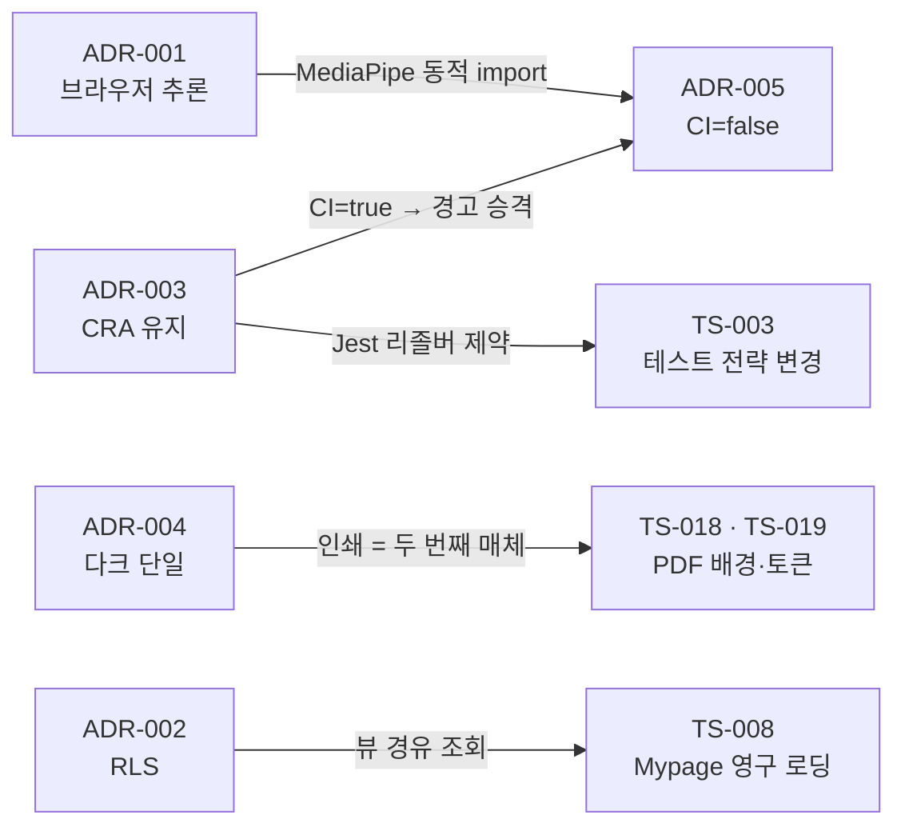

# 기술 의사결정 기록 (ADR)

"왜 A 대신 B를 골랐는가"를 한 건에 한 페이지씩 남긴다.
형식은 **맥락 → 선택지 → 결정 → 근거 → 대가 → 결과**이고,
**결과 칸에 예측이 틀렸으면 틀렸다고 적는다.** 그게 이 문서의 존재 이유다.

| # | 결정 | 한 줄 요약 | 결과 |
|---|---|---|---|
| [001](001-in-browser-inference.md) | 얼굴 추론을 브라우저에서 | 영상 프레임을 기기 밖으로 내보내지 않는다 | 의도대로. 단, 예상 못 한 빌드 비용이 붙었다 |
| [002](002-rls-authorization.md) | 권한을 RLS로 | 앱 코드가 실수해도 DB가 막는다 (정책 17개) | 유출 없음. Edge Function만 이 보호 밖 |
| [003](003-keep-cra.md) | CRA 유지 | Vite 이전보다 기능 완성이 우선 | 판단은 유지. 비용을 과소평가했다 (TS-003, TS-020) |
| [004](004-dark-only-theme.md) | 다크 단일 테마 | 대비비 검증을 한 벌만 한다 | **절반만 맞았다.** 인쇄가 두 번째 매체로 등장 |
| [005](005-ci-false-over-craco.md) | `CI=false` (CRACO 대신) | 서드파티 경고 하나에 빌드 의존성을 늘리지 않는다 | 통과. 대가를 알고 고른 선택 |

## 서로 어떻게 얽혀 있나

**세 건이 서로를 물고 있다.** ADR-005의 문제는 ADR-001과 ADR-003이 각각 절반씩 만든 것이고,
어느 한쪽만 봐서는 원인이 안 보인다. 트러블슈팅 다섯 건이 ADR 네 건의 "대가" 칸에서 나왔다.

## 관련 문서

- [../TROUBLESHOOTING-TOP5.md](../TROUBLESHOOTING-TOP5.md) — 위 표의 결과 칸이 실제로 어떻게 터졌는지
- [../TROUBLESHOOTING.md](../TROUBLESHOOTING.md) — TS-001~020 전체
- [../DATABASE.md](../DATABASE.md) · [../API.md](../API.md) — ADR-002·003이 만든 결과물
